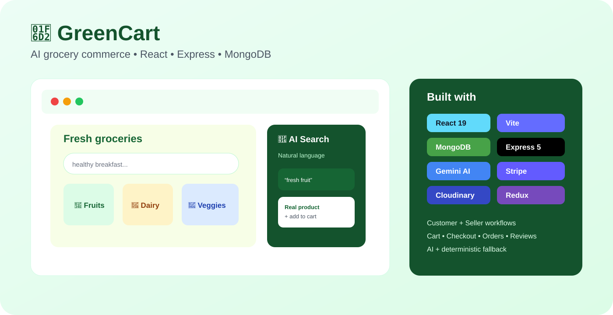
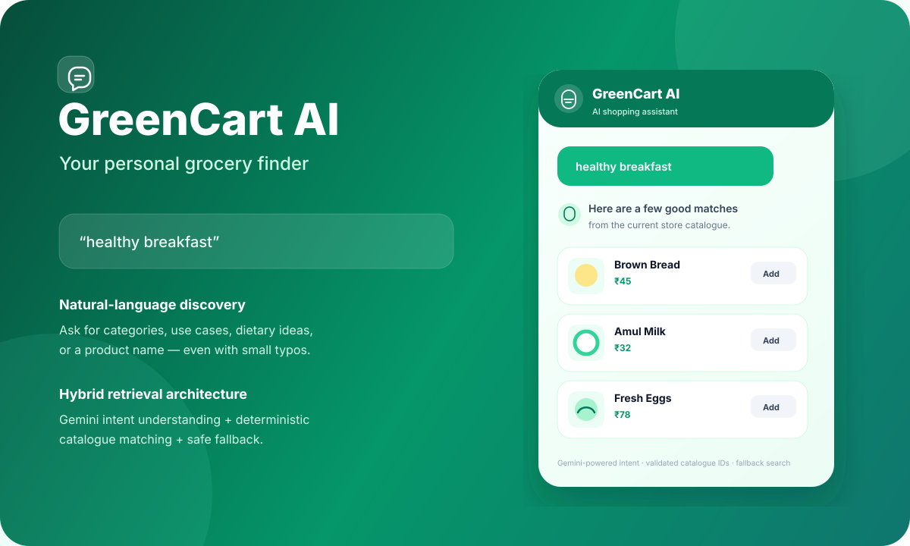

# 🛒 GreenCart — AI Grocery E-Commerce

<p align="center"></p>

<p align="center"><strong>A full-stack multivendor grocery platform covering AI product discovery, shopping, seller workflows, reviews, authentication, Stripe checkout and cloud media.</strong></p>

<p align="center"><a href="https://github.com/duttasirius/ggrocery">💻 Source Code</a> · <strong>Development branch: dev</strong></p>

## ⚡ At a Glance

| Area | Implementation |
|---|---|
| 🖥️ Frontend | React 19, Vite, Tailwind CSS 4 |
| ⚙️ Backend | Node.js, Express 5 |
| 🗄️ Database | MongoDB + Mongoose |
| 🤖 AI | Google Gemini + deterministic fallback |
| 🔐 Auth | JWT + cookie-based sessions |
| 🧠 State | React / Redux Toolkit |
| 💳 Payments | Stripe + Cash on Delivery |
| ☁️ Media | Cloudinary |

## 🚀 Complete Commerce Flow

```text
Discover → AI Search → Product → Review → Cart → Address → Payment → Order → Seller Fulfillment
```

### 🤖 AI Product Discovery

Users can search naturally instead of knowing exact product names:

`healthy breakfast` · `fresh fruit` · `something for breakfast` · `show me brown rice` · `amol milk`

The architecture combines Gemini intent understanding with deterministic catalog matching. **MongoDB remains the source of truth.**

```text
Customer query
      ↓
Normalize / tokenize
      ↓
Deterministic catalog matching
      ↓
Gemini intent understanding
      ↓
Validate product IDs
      ↓
Merge results
      ↓
Real product cards → Cart
```

If Gemini is unavailable, deterministic matching can still return useful catalog results. This keeps AI as an enhancement rather than a shopping dependency.

### 🏪 Seller / Multivendor Architecture

- Seller authentication and protected routes
- Product creation and management
- Pricing, offers and stock management
- Four-image product galleries
- Cloudinary uploads
- Seller-side order visibility

### ⭐ Reviews & Ratings

- Product-specific reviews
- 1–5 star ratings
- Average rating and review count
- Create / edit / delete own reviews
- One review per user per product

### 💳 Checkout & Orders

- Stripe checkout
- Stripe payment verification
- Cash on Delivery
- Cart persistence for authenticated users
- Address selection and saved addresses
- Order history
- Seller order visibility

### 🔐 Authentication

- Registration / login
- Password hashing
- JWT authentication
- Cookie-based sessions
- Protected customer operations
- Separate seller authorization boundary

### 📱 Responsive UI

Designed for desktop, laptop, tablet and mobile with responsive navigation, product cards, galleries, loading/error/empty states, toast feedback and an integrated AI assistant.

## 🖼️ Visual Showcase

<p align="center"></p>

<p align="center"></p>

## 🏗️ Architecture

```text
React + Vite + Tailwind
          │
       Axios / HTTP
          ▼
     Express 5 API
    ┌─────┼────────────┐
    ▼     ▼            ▼
 MongoDB Cloudinary  Gemini
    │                  │
    ├─ Products        └─ Intent
    ├─ Users              + catalog IDs
    ├─ Cart                    │
    ├─ Orders                  ▼
    └─ Reviews          server validation
          │
          ├──── Stripe
          └──── Seller APIs
```

## 🧰 Technology Stack

**Frontend:** React 19 · Vite · Tailwind CSS 4 · Axios · React Router · Lucide React

**Backend:** Node.js · Express 5 · MongoDB · Mongoose · JWT · bcryptjs · Cookie Parser

**AI:** Google Gemini · hybrid AI + deterministic retrieval

**Services:** Stripe · Cloudinary

## 🎯 Interview Talking Points

- Why hybrid AI + deterministic retrieval is safer for commerce
- How model output is validated against MongoDB
- Fallback behavior when an external AI service fails
- Seller/customer authorization boundaries
- Stripe verification and order creation
- Product review uniqueness
- Cloudinary media architecture
- Designing a complete commerce lifecycle instead of isolated CRUD pages

## 📁 Structure

```text
client/
├── src/components/   # storefront + AI assistant
├── src/pages/        # shopping flows
├── src/context/      # application state
└── src/assets/       # product and UI assets

server/
├── controllers/      # commerce + AI logic
├── models/            # MongoDB schemas
├── routes/            # REST APIs
└── middleware/        # authentication / protection
```

## 🔑 Local Development

```bash
git clone -b dev https://github.com/duttasirius/ggrocery.git
cd ggrocery

cd server && npm install && npm run server
# second terminal
cd client && npm install && npm run dev
```

Configure MongoDB, JWT, Gemini, Stripe and Cloudinary variables locally. Never commit real secrets.

## 📌 Recruiter Snapshot

**GreenCart demonstrates:** React + Node + Express + MongoDB · AI search · multivendor architecture · authentication · payments · reviews · Cloudinary · Redux/state management · responsive UI · failure-tolerant external-service integration.
